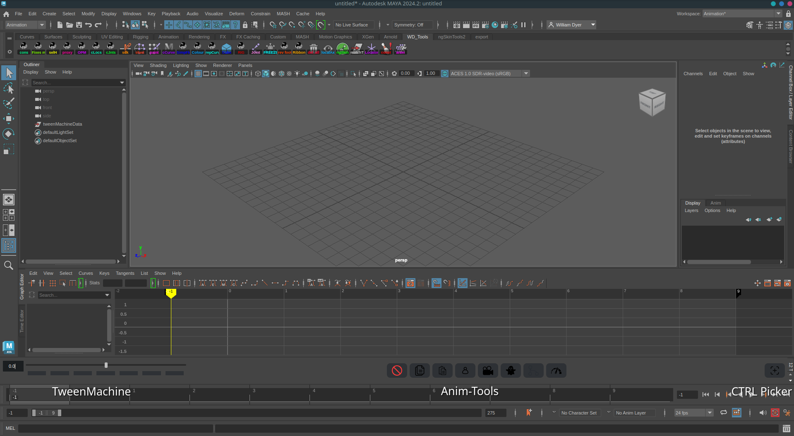

<h1 align="center">MAT aka. Maya-Anim-Tools</h1>
<p align="center">
    
    
    
    
</p>
<div align="center">
    
</div>

### Running The Tool

> [!WARNING]
> - All tools are designed to be either run through the Maya script editor or a shelf tool and can be ran with a similar code to the below.<br>
> - code to be placed in scripts folder or location within MAYA_SCRIPT_PATH.

```python
from mat.maya_anim_tools import main

main.run()
```
